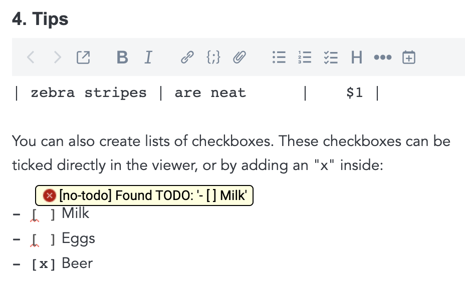

This plugin is still under development.

## What is _Lint_?

_Lint_, or _linter_, is a kind of tool for programmers to mark source code fragment(s) which doesn't conform to a specific format. Programmers usually use lint to find potential bugs or nonstandard code when they're coding.

For non-programmers, lint is also helpful when they hope to keep their writing conformed to specific formats. For example, someone may want to be reminded not to leave `todo:` in text.

### Markdownlint & textlint

[Markdownlint](https://github.com/DavidAnson/markdownlint) and [textlint](https://textlint.github.io/) are both open-source lint tools for daily writing, with many community-made rules([markdownlint rules](https://github.com/DavidAnson/markdownlint/blob/main/doc/Rules.md), [textlint rules](https://github.com/textlint/textlint/wiki/Collection-of-textlint-rule#contents)). Each rule specify a format to check. For example, with [textlint no-todo rule](https://github.com/textlint-rule/textlint-rule-no-todo), textlint will check whether `todo` or `- []` is existing in text, with [markdownlint no-inline HTML rule](https://github.com/DavidAnson/markdownlint/blob/main/doc/Rules.md#md033---inline-html), markdownlint will check whether HTML code is existing in text.

Some rules are also fixable, which means they can report and **fix** problems. For example, textlint no-todo rule can remove `todo` mark for you if you choose to do so.

### Why two linters?

Markdownlint and textlint look similar: they both parse your markdown text and apply some rules to check. However, they have different goals and you can tell from their rules list:

- markdownlint: focus on Markdown syntax check
- textlint: focus on text's content check

## Joplin with markdownlint & textlint

With this plugin, you can integrate markdownlint & textlint into Joplin. You can configure any rules you like, this plugin will download them to let markdownlint & textlint check and report.
